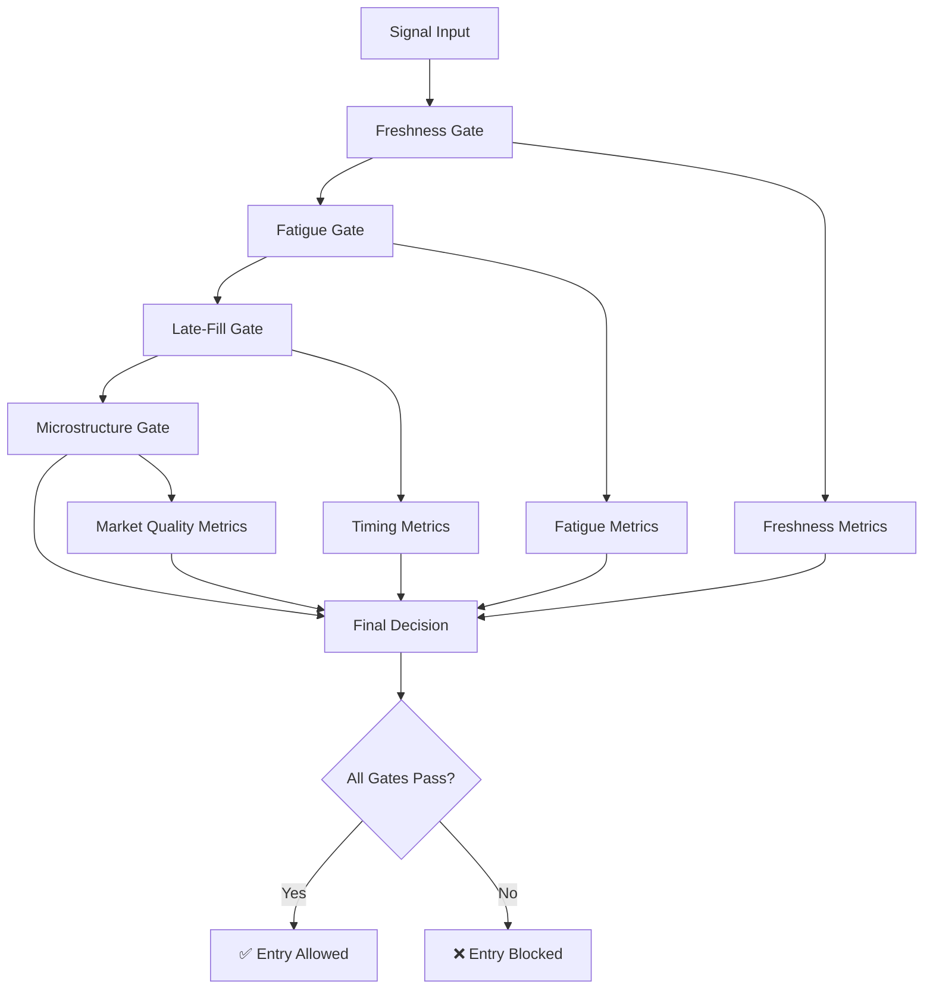

# CryptoRun Entry Gates System

## UX MUST — Live Progress & Explainability

Complete guide to CryptoRun's unified entry gate system, providing transparent and deterministic evaluation of trading signal quality with comprehensive explanations and CLI debugging tools.

## Overview

The CryptoRun entry gates system implements a multi-stage validation pipeline that evaluates trading signals before entry. Each gate has specific thresholds and provides detailed reasoning for pass/fail decisions.

## Gate Evaluation Flow



## Gate Specifications

### 1. Freshness Gate

**Purpose**: Ensures signals are recent and price moves are within acceptable ranges.

**Criteria**:
- **Bars Age**: ≤ 2 bars from signal generation
- **Price Move**: ≤ 1.2× ATR (1-hour) from signal price

**Failure Reasons**:
- `stale_bars`: Signal is > 2 bars old
- `excessive_move`: Price moved > 1.2× ATR from signal

**Metrics Provided**:
- `bars_age`: Number of bars since signal
- `price_change`: Absolute price change from signal
- `atr_1h`: 1-hour Average True Range
- `atr_ratio`: Price change / ATR ratio

### 2. Fatigue Gate

**Purpose**: Prevents entries into overextended moves that lack momentum acceleration.

**Criteria**:
- Block if **24h momentum > +12%** AND **RSI(4h) > 70** UNLESS **acceleration ≥ 2%**

**Logic**:
```
if (momentum_24h > 12.0 AND rsi_4h > 70.0) then
    if (acceleration < 2.0) then
        BLOCK with "fatigue_block"
    else
        ALLOW with "fatigue_pass" (acceleration override)
    end
else
    ALLOW with "fatigue_pass"
end
```

**Failure Reasons**:
- `fatigue_block`: High momentum + overbought RSI without sufficient acceleration

**Metrics Provided**:
- `momentum_24h`: 24-hour momentum percentage
- `rsi_4h`: 4-hour RSI value
- `acceleration`: 4-hour acceleration percentage

### 3. Late-Fill Gate

**Purpose**: Ensures execution timing is within acceptable limits after signal generation.

**Criteria**:
- **Execution Delay**: ≤ 30 seconds from signal time

**Failure Reasons**:
- `late_fill`: Execution > 30 seconds after signal

**Metrics Provided**:
- `execution_delay_seconds`: Time between signal and execution

### 4. Microstructure Gate (Optional)

**Purpose**: Validates market microstructure quality for safe execution.

**Criteria** (all must pass):
- **Spread**: ≤ 50 basis points
- **Depth**: ≥ $100,000 within ±2% of mid-price
- **VADR**: ≥ 1.75× (Volume-Adjusted Daily Range)

**Failure Reasons**:
- `spread_too_wide_XXXbps`: Spread exceeds 50 bps
- `insufficient_depth_$XXX`: Depth below $100k requirement
- `low_vadr_X.XXx`: VADR below 1.75× threshold

**Metrics Provided**:
- `spread_bps`: Current bid-ask spread in basis points
- `depth_usd`: Available liquidity within ±2% range
- `vadr`: Volume-Adjusted Daily Range multiplier

**Note**: Microstructure gate only evaluates when market data is provided. When unavailable, this gate is skipped.

## Boundary Conditions

### Critical Thresholds

| Gate | Metric | Pass Threshold | Boundary Examples |
|------|--------|---------|---------|
| Freshness | Bars Age | ≤ 2 | 2 bars = PASS, 3 bars = FAIL |
| Freshness | ATR Ratio | ≤ 1.2 | 1.20× = PASS, 1.21× = FAIL |
| Fatigue | Combined Rule | See logic above | 12.0% + RSI 70.0 + accel 2.0% = PASS |
| Late-Fill | Delay | ≤ 30s | 30s = PASS, 31s = FAIL |
| Microstructure | Spread | ≤ 50 bps | 50.0 bps = PASS, 50.1 bps = FAIL |
| Microstructure | Depth | ≥ $100k | $100,000 = PASS, $99,999 = FAIL |
| Microstructure | VADR | ≥ 1.75× | 1.75× = PASS, 1.74× = FAIL |

## CLI Usage

### Basic Gate Explanation

```bash
# Explain gates for a symbol with default parameters
cryptorun gates explain --symbol BTCUSD

# Explain with specific timing
cryptorun gates explain --symbol ETHUSD --at 2025-09-07T14:30:00Z

# Explain with custom gate parameters
cryptorun gates explain --symbol SOLUSD \
  --bars-age 2 \
  --price-change 150.0 \
  --atr-1h 120.0 \
  --momentum-24h 15.0 \
  --rsi-4h 75.0 \
  --acceleration 1.8
```

### Advanced Examples

```bash
# Test fatigue override scenario
cryptorun gates explain --symbol ADAUSD \
  --momentum-24h 13.0 \
  --rsi-4h 72.0 \
  --acceleration 2.5

# Test microstructure requirements
cryptorun gates explain --symbol DOGEUSD \
  --spread-bps 45.0 \
  --depth-usd 150000 \
  --vadr 2.1

# Test boundary conditions
cryptorun gates explain --symbol MATICUSD \
  --bars-age 2 \
  --price-change 120.0 \
  --atr-1h 100.0

# JSON output for automation
cryptorun gates explain --symbol LINKUSD --json
```

## Example CLI Output

### Passing All Gates

```
✅ BTCUSD: ALL GATES PASSED

📊 Gate Details:
   ✅ freshness: fresh
      • Price move: 0.80x ATR (limit: 1.2x)
      • Bars age: 1 (limit: 2)
   ✅ fatigue: fatigue_pass
      • 24h momentum: 8.5% (fatigue threshold: >12%)
      • RSI 4h: 65.0 (overbought threshold: >70)
      • Acceleration: 1.2% (override threshold: ≥2%)
   ✅ late_fill: timely_fill
      • Execution delay: 15.0s (limit: 30s)
   ✅ microstructure: microstructure_pass
      • Spread: 35.0 bps (limit: 50 bps)
      • Depth: $125000 (limit: $100k)
      • VADR: 2.15x (limit: 1.75x)

🕐 Evaluation time: 2025-09-07 14:30:15
```

### Blocked by Fatigue

```
❌ ETHUSD: ENTRY BLOCKED
   Overall: blocked_by_fatigue: fatigue_block

📊 Gate Details:
   ✅ freshness: fresh
      • Price move: 0.95x ATR (limit: 1.2x)
      • Bars age: 1 (limit: 2)
   ❌ fatigue: fatigue_block
      • 24h momentum: 15.2% (fatigue threshold: >12%)
      • RSI 4h: 72.0 (overbought threshold: >70)
      • Acceleration: 1.8% (override threshold: ≥2%)
   ✅ late_fill: timely_fill
      • Execution delay: 12.0s (limit: 30s)

💡 To simulate passing gates, try:
  Override fatigue with stronger acceleration: --acceleration 2.5

🕐 Evaluation time: 2025-09-07 14:30:15
```

## Integration Points

### Application Integration

```go
import "github.com/sawpanic/cryptorun/internal/domain/gates"

// Evaluate all gates for a trading signal
inputs := gates.EvaluateAllGatesInputs{
    Symbol:        "BTCUSD",
    Timestamp:     time.Now(),
    BarsAge:       1,
    PriceChange:   120.0,
    ATR1h:         150.0,
    Momentum24h:   8.5,
    RSI4h:         65.0,
    Acceleration:  1.2,
    SignalTime:    signalTime,
    ExecutionTime: time.Now(),
    // Optional microstructure data
    Spread:        &spreadBps,
    Depth:         &depthUSD,
    VADR:          &vadrValue,
}

result, err := gates.EvaluateAllGates(ctx, inputs)
if err != nil {
    return fmt.Errorf("gate evaluation failed: %w", err)
}

if !result.Passed {
    log.Warn().
        Str("symbol", result.Symbol).
        Str("reason", result.OverallReason).
        Msg("Entry blocked by gates")
    return nil // Skip this signal
}

// Proceed with entry logic
```

### Menu System Integration

The gates system integrates with the interactive menu for real-time testing and debugging:

1. **Menu Option**: "Test Entry Gates"
2. **Interactive Input**: Prompts for symbol and parameters
3. **Real-time Results**: Shows gate evaluation with explanations
4. **What-if Analysis**: Allows parameter adjustment and re-testing

## Error Handling

### Common Errors

- **Invalid Symbol**: Symbol not found in universe
- **Missing Required Data**: ATR, momentum, or RSI unavailable
- **Timestamp Parse Errors**: Invalid RFC3339 format
- **Negative Values**: Invalid negative inputs for positive metrics

### Graceful Degradation

- **Missing Microstructure Data**: Gate skipped, does not fail overall evaluation
- **Optional Parameters**: Default values used when not provided
- **Connectivity Issues**: Falls back to cached data when available

## Performance Characteristics

- **Latency**: < 1ms for gate evaluation (excluding data fetching)
- **Memory Usage**: Minimal, stateless evaluation
- **Concurrency**: Thread-safe, supports parallel evaluation
- **Caching**: No internal caching, relies on upstream data caches

## Testing and Validation

### Test Coverage

The gates system includes comprehensive test coverage for:

- **Boundary Conditions**: Exact threshold testing (2 vs 3 bars, 1.2 vs 1.21 ATR)
- **Combined Scenarios**: Multiple gate failures and interactions
- **Edge Cases**: Missing data, extreme values, timing edge cases
- **Output Format Validation**: CLI output consistency and JSON schema

### Continuous Validation

- **Conformance Tests**: Ensure gate logic matches specification
- **Performance Tests**: Validate sub-millisecond evaluation times
- **Integration Tests**: End-to-end testing with real market data

## Troubleshooting

### Common Issues

1. **Gates Always Failing**
   - Check parameter ranges against boundary conditions
   - Verify timestamp formats (use RFC3339)
   - Ensure ATR values are reasonable for asset price levels

2. **Microstructure Gate Missing**
   - Confirm spread, depth, and VADR parameters are provided (≥ 0)
   - Use -1 values to explicitly skip microstructure evaluation

3. **CLI Parameter Confusion**
   - Use `--help` flag for parameter descriptions
   - Check example commands in this documentation
   - Validate parameter types (float64 vs int)

### Debug Tips

```bash
# Test individual gates by setting others to pass
cryptorun gates explain --symbol BTCUSD --bars-age 1 --momentum-24h 5.0 --rsi-4h 50.0

# Use JSON output for programmatic analysis
cryptorun gates explain --symbol ETHUSD --json | jq '.reasons[] | select(.passed == false)'

# Test exact boundary conditions
cryptorun gates explain --symbol SOLUSD --bars-age 2 --price-change 120.0 --atr-1h 100.0
```

## Future Enhancements

### Planned Features

1. **Historical Gate Analysis**: Batch evaluation against historical signals
2. **Gate Performance Metrics**: Success rates and correlations with returns
3. **Dynamic Thresholds**: Regime-aware gate parameter adjustment
4. **Gate Ranking**: Priority ordering for multi-gate failures

### Configuration Options

Future versions will support:
- Configurable gate thresholds per regime
- Custom gate combinations and weights
- Asset-class specific parameters
- A/B testing framework for threshold optimization

---

*This documentation is automatically validated by the CryptoRun documentation UX guard to ensure consistency and completeness.*