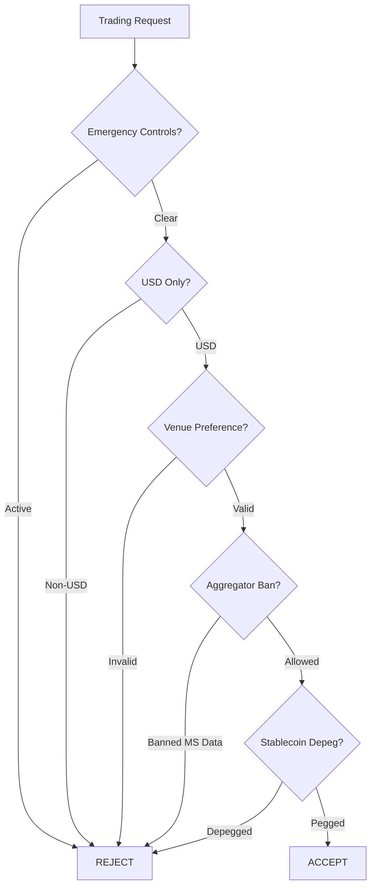

# CryptoRun Policy Enforcement System

This document describes the policy enforcement system that ensures CryptoRun v3.2.1 operates within strict product requirements and risk management guidelines.

## UX MUST — Live Progress & Explainability

All policy violations provide clear reason codes and detailed explanations to help users understand and resolve issues quickly.

## Core Policies

### 1. USD Pairs Only
- **Policy**: Only USD-quoted trading pairs are allowed
- **Reason Code**: `NON_USD_QUOTE`
- **Implementation**: Symbol must end with "USD" (case insensitive)
- **Examples**: 
  - ✅ Allowed: `BTCUSD`, `ETHUSD`, `ethusd`
  - ❌ Rejected: `BTCEUR`, `BTCUSDT`, `BTC`

### 2. Venue Preference Ordering
- **Policy**: Kraken → Binance → OKX → Coinbase preference for data and execution
- **Reason Code**: `VENUE_NOT_PREFERRED`
- **Implementation**: Configurable preference ordering with fallback control
- **Default Order**: `["kraken", "binance", "okx", "coinbase"]`

### 3. Exchange-Native Microstructure Only
- **Policy**: Ban aggregators for microstructure data (depth, spread, orderbook)
- **Reason Code**: `AGGREGATOR_BANNED`
- **Banned Sources**: DEXScreener, CoinGecko, CMC, Paprika, Etherscan, Moralis
- **Microstructure Data Types**: `depth`, `spread`, `orderbook`, `l1`, `l2`, `trades`, `ticker`
- **Note**: Aggregators allowed for non-microstructure data (price, market, social)

### 4. Stablecoin Depeg Guard
- **Policy**: Reject stablecoins trading beyond ±0.5% of $1.00 peg
- **Reason Code**: `STABLECOIN_DEPEG`
- **Threshold**: 0.5% (configurable)
- **Monitored Stablecoins**: USDT, USDC, BUSD, DAI, TUSD, USDD, FRAX

### 5. Emergency Controls
- **Global Pause**: Halt all trading system-wide
  - **Reason Code**: `GLOBAL_PAUSE`
- **Symbol Blacklist**: Block specific symbols
  - **Reason Code**: `SYMBOL_BLACKLISTED`
- **Venue-Symbol Controls**: Block specific symbol-venue combinations
  - **Reason Code**: `EMERGENCY_CONTROL`

## Implementation Architecture

### Core Components

```go
// PolicyValidator - Core validation engine
type PolicyValidator struct {
    globalPause           bool
    blacklist             map[string]bool
    emergencyControls     map[string]bool
    venuePreferenceOrder  []string
    stablecoinThreshold   float64
    aggregatorBlacklist   []string
}

// ValidationError - Structured error response
type ValidationError struct {
    Reason  ReasonCode                 // Violation reason
    Symbol  string                     // Affected symbol
    Venue   string                     // Affected venue
    Message string                     // Human-readable message
    Details map[string]interface{}     // Additional context
}
```

### Integration Points

#### Scanner Integration
```go
si := NewScannerIntegration(enforcer)

// Pre-scan validation
err := si.PreScanValidation(ctx, symbols, venue)

// Individual symbol validation
err := si.ValidateSymbolForScanning(ctx, symbol, venue, price)
```

#### Gate Integration
```go
gi := NewGateIntegration(enforcer)

// Entry gate validation
err := gi.ValidateEntryGate(ctx, symbol, venue, score, vadr, price)

// Microstructure data validation
err := gi.ValidateMicrostructureData(ctx, symbol, venue, dataSource)
```

#### Global Management
```go
gpm := NewGlobalPolicyManager()

// Emergency controls
gpm.SetGlobalPause(true)
gpm.AddToBlacklist("SCAMUSD")
gpm.SetEmergencyControl("binance", "RISKYUSD", true)
```

## Policy Matrix

| Policy | Scanner | Gates | Data Sources | Emergency |
|--------|---------|-------|--------------|-----------|
| USD Only | ✅ | ✅ | ✅ | Override |
| Venue Preference | ✅ | ✅ | ✅ | Override |
| Aggregator Ban | ❌ | ✅ | ✅ | Override |
| Stablecoin Depeg | ✅ | ✅ | ✅ | Override |
| Emergency Controls | ✅ | ✅ | ✅ | N/A |

## Validation Flow



## Error Response Format

All policy violations return structured errors:

```json
{
  "reason": "NON_USD_QUOTE",
  "symbol": "BTCEUR",
  "venue": "kraken",
  "message": "Only USD pairs allowed, got BTCEUR",
  "details": {
    "policy": "USD_ONLY",
    "violation": "non-USD quote currency",
    "allowed_quote": "USD"
  }
}
```

## Configuration

### Default Settings
```go
venuePreferenceOrder  = ["kraken", "binance", "okx", "coinbase"]
stablecoinThreshold   = 0.005  // ±0.5%
aggregatorBlacklist   = ["dexscreener", "coingecko", "cmc", "paprika", "etherscan", "moralis"]
```

### Runtime Controls
- Global pause: `SetGlobalPause(bool)`
- Blacklist management: `AddToBlacklist(symbol)`, `RemoveFromBlacklist(symbol)`
- Emergency controls: `SetEmergencyControl(venue, symbol, active)`

## Testing

### Unit Test Coverage
- **USD-only validation**: Valid/invalid pairs, case sensitivity
- **Venue preference**: Preference ordering, fallback behavior
- **Aggregator ban**: Microstructure vs non-microstructure data types
- **Stablecoin depeg**: Threshold enforcement, stablecoin detection
- **Emergency controls**: Global pause, blacklists, venue-specific blocks

### Integration Test Scenarios
- **Full workflow**: Scan → validate → gate entry
- **Emergency response**: Global pause activation during operations
- **Mixed violations**: Multiple policy failures, first-failure reporting

## Monitoring & Observability

### Policy Status Endpoint
```go
status := gpm.GetPolicyStatus()
// Returns:
// - global_pause: bool
// - blacklisted_symbols: []string
// - emergency_controls: []string  
// - venue_preference_order: []string
// - stablecoin_threshold: float64
// - banned_aggregators: []string
```

### Logging
All policy violations are logged with structured context:
- Violation reason and code
- Affected symbol/venue
- Request details
- Resolution suggestions

## Migration from Legacy System

### Breaking Changes
- All non-USD pairs will be rejected
- Aggregator-sourced microstructure data blocked
- Venue preference enforcement may change execution routing

### Migration Steps
1. **Audit current pairs**: Identify non-USD pairs for removal/replacement
2. **Update data sources**: Replace aggregator microstructure feeds with exchange-native
3. **Test venue fallbacks**: Verify fallback behavior matches expectations
4. **Configure emergency controls**: Set up monitoring and emergency response procedures

## Security Considerations

### Access Control
- Emergency controls require administrative privileges
- Policy changes logged for audit trail
- Real-time alerting on emergency activations

### Fail-Safe Design
- Default-deny on unknown symbols/venues
- Emergency controls override all other policies
- Policy validation happens before any market operations

## Performance Impact

### Validation Overhead
- **Scanner**: <1ms per symbol validation
- **Gates**: <0.5ms per entry validation  
- **Memory**: ~1MB policy configuration storage
- **CPU**: Negligible for typical workloads

### Optimization
- Policies cached in memory for fast access
- Validation shortcuts for emergency states
- Bulk validation for scanner symbol lists

---

## Related Documentation
- [PROVIDERS.md](PROVIDERS.md) - Provider rate limiting and circuit breakers
- [GATES.md](GATES.md) - Entry gate implementation
- [SCORING.md](SCORING.md) - Composite scoring system
- [CLI.md](CLI.md) - Command-line interface integration