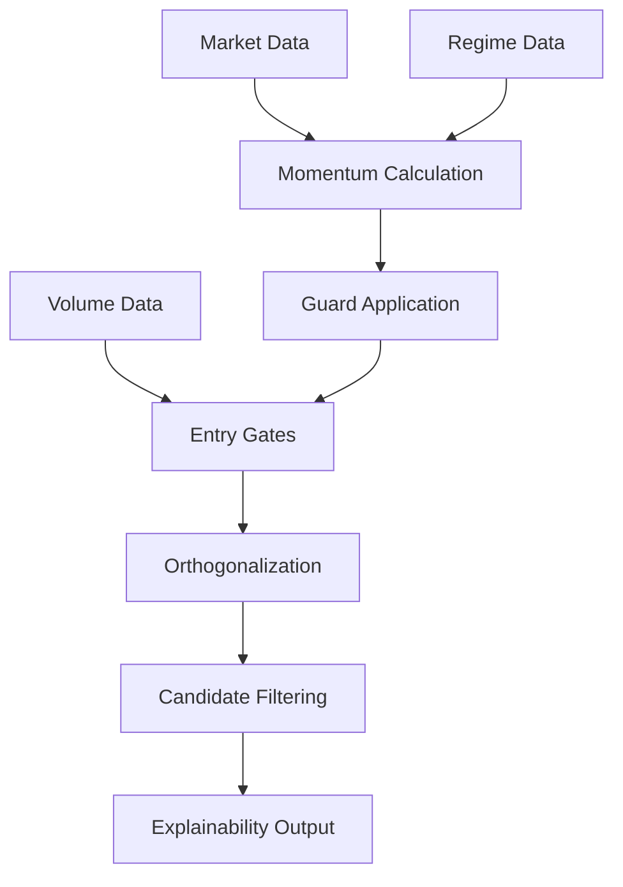

# Scan Pipeline Documentation

## Overview

CryptoRun implements specialized scanning pipelines for different trading opportunities. Each pipeline combines algorithmic analysis with explainability and guard systems to produce high-confidence trading signals.

## MomentumPipeline

### Purpose
Multi-timeframe momentum scanning optimized for 6-48 hour holding periods with comprehensive guard systems and factor orthogonalization.

### Configuration

Pipeline configuration via `config/momentum.yaml`:

```yaml
# Timeframe Weights (must sum to 100%)
weights:
  tf_1h: 0.20    # 1-hour timeframe weight (20%)
  tf_4h: 0.35    # 4-hour timeframe weight (35%) - primary
  tf_12h: 0.30   # 12-hour timeframe weight (30%)
  tf_24h: 0.15   # 24-hour timeframe weight (15%)

# Guard Configuration
fatigue:
  return_24h_threshold: 12.0  # Block if 24h return > +12%
  rsi_4h_threshold: 70.0      # RSI threshold on 4h timeframe
  accel_renewal: true         # Allow override if acceleration is positive

freshness:
  max_bars_age: 2            # Maximum age in bars (≤2 bars)
  atr_window: 14             # ATR calculation window
  atr_factor: 1.2            # Price movement threshold (1.2×ATR)

late_fill:
  max_delay_seconds: 30      # Maximum delay after bar close (30s)
```

### Pipeline Flow



#### Step 1: Data Collection
- **Market Data**: OHLCV for timeframes [1h, 4h, 12h, 24h]
- **Volume Data**: 20-period volume history for surge detection
- **Regime Data**: Current market regime for weight adaptation

#### Step 2: Momentum Analysis
- Calculate timeframe-specific momentum scores
- Apply regime-adaptive weights
- Compute 4h acceleration for fatigue override
- Generate weighted core score

#### Step 3: Guard Validation
- **Fatigue Guard**: Check for overextended conditions
- **Freshness Guard**: Validate data age and price movement
- **Late-Fill Guard**: Ensure timely execution capability

#### Step 4: Entry/Exit Evaluation
- **Score Gate**: Minimum momentum threshold (2.5)
- **Volume Gate**: Volume surge requirement (1.75×)
- **ADX Gate**: Trend strength requirement (≥25.0)
- **Hurst Gate**: Persistence requirement (≥0.55)

#### Step 5: Orthogonalization
- Build factor matrix with MomentumCore protection
- Apply Gram-Schmidt orthogonalization
- Update candidate scores with orthogonal values
- Preserve MomentumCore characteristics

#### Step 6: Candidate Filtering
- Filter qualified candidates based on all gate results
- Apply symbol limits if configured
- Sort by orthogonal score

#### Step 7: Explainability Generation
- Generate comprehensive attribution data
- Calculate confidence scores
- Document processing times and data sources
- Create explainability JSON output

### Data Structures

#### MomentumCandidate
```go
type MomentumCandidate struct {
    Symbol          string                      `json:"symbol"`
    Timestamp       time.Time                   `json:"timestamp"`
    MomentumResult  *momentum.MomentumResult    `json:"momentum_result"`
    EntrySignal     *momentum.EntrySignal       `json:"entry_signal,omitempty"`
    OrthogonalScore float64                     `json:"orthogonal_score"`
    Qualified       bool                        `json:"qualified"`
    Reason          string                      `json:"reason,omitempty"`
    Attribution     Attribution                 `json:"attribution"`
}
```

#### Attribution
```go
type Attribution struct {
    DataSources    []string      `json:"data_sources"`
    ProcessingTime time.Duration `json:"processing_time"`
    Methodology    string        `json:"methodology"`
    Confidence     float64       `json:"confidence"`
    GuardsPassed   []string      `json:"guards_passed"`
    GuardsFailed   []string      `json:"guards_failed"`
}
```

### Usage Examples

#### Basic Momentum Scan
```go
config := pipeline.MomentumPipelineConfig{
    // Load from config/momentum.yaml
}

dataProvider := kraken.NewDataProvider()
mp := pipeline.NewMomentumPipeline(config, dataProvider, "./out/momentum")

symbols := []string{"BTCUSD", "ETHUSD", "ADAUSD"}
candidates, err := mp.ScanMomentum(context.Background(), symbols, dataProvider)
```

#### With Custom Configuration
```go
config := pipeline.MomentumPipelineConfig{
    Pipeline: pipeline.PipelineConfig{
        ExplainabilityOutput: true,
        OutputPath:          "./custom/output",
        ProtectedFactors:    []string{"MomentumCore"},
        MaxSymbols:         20,
    },
}
```

### Output Structure

#### Explainability JSON
```json
{
  "scan_metadata": {
    "timestamp": "2025-09-06T15:30:00Z",
    "processing_time": "1.234s",
    "total_candidates": 5,
    "methodology": "CryptoRun MomentumCore v3.2.1 with Gram-Schmidt orthogonalization"
  },
  "configuration": {
    "momentum_config": { ... },
    "entry_exit_config": { ... },
    "pipeline_config": { ... }
  },
  "candidates": [
    {
      "symbol": "BTCUSD",
      "qualified": true,
      "orthogonal_score": 4.8,
      "attribution": {
        "data_sources": ["market_data", "volume_data", "regime_data", "gram_schmidt_orthogonalization"],
        "processing_time": "245ms",
        "methodology": "multi_timeframe_momentum_v3.2.1_with_orthogonalization",
        "confidence": 87.5,
        "guards_passed": ["fatigue_guard", "freshness_guard", "late_fill_guard", "score_gate", "volume_gate"]
      }
    }
  ],
  "summary": {
    "qualified_count": 3,
    "avg_score": 3.2,
    "top_performer": "BTCUSD"
  }
}
```

## Quality-Dip Pipeline (Future)

### Purpose
Identify high-probability pullback opportunities within established uptrends using Fibonacci retracements and quality signals.

### Key Features (Planned)
- Fibonacci retracement analysis (38.2% - 61.8% range)
- RSI divergence detection
- Trend qualification with MA slopes and ADX
- Quality signal validation
- False-positive guards for news shocks and stair-step patterns

## Performance Benchmarks

### Processing Targets

| Metric | Target | Measurement |
|--------|---------|-------------|
| P99 Latency | <300ms | Per symbol processing |
| Throughput | 100 symbols/sec | Concurrent processing |
| Memory Usage | <50MB | Per 100 symbols |
| Cache Hit Rate | >85% | Market data retrieval |

### Optimization Strategies

#### Parallel Processing
```go
func (mp *MomentumPipeline) processConcurrent(symbols []string, maxConcurrent int) {
    sem := make(chan struct{}, maxConcurrent)
    var wg sync.WaitGroup
    
    for _, symbol := range symbols {
        wg.Add(1)
        go func(sym string) {
            defer wg.Done()
            sem <- struct{}{}
            defer func() { <-sem }()
            
            mp.processSingleSymbol(ctx, sym, regime, dataProvider, startTime)
        }(symbol)
    }
    
    wg.Wait()
}
```

#### Data Caching
- **Hot Data**: Real-time prices and volumes (TTL: 5s)
- **Warm Data**: Technical indicators and regime (TTL: 5min)
- **Cold Data**: Historical analysis and backtests (TTL: 1hr)

#### Memory Management
- Stream processing for large symbol sets
- Garbage collection optimization
- Memory pooling for frequent allocations

## Integration Points

### Data Providers

#### Primary: Kraken
- REST API for historical data
- WebSocket for real-time updates
- Native USD pairs only
- Rate limiting: 1000/minute

#### Secondary: Exchange APIs
- Binance, OKX, Coinbase Pro
- Fallback and validation sources
- Circuit breaker integration

### Output Destinations

#### File System
- JSON explainability reports
- CSV candidate summaries
- Performance metrics logs

#### Database (Optional)
- PostgreSQL for candidate history
- Redis for real-time caching
- InfluxDB for metrics time-series

#### APIs
- HTTP endpoints for live scanning
- WebSocket for real-time updates
- Webhook notifications for qualified candidates

## Error Handling & Monitoring

### Circuit Breakers
```go
type CircuitBreaker struct {
    failureThreshold int
    timeout         time.Duration
    onStateChange   func(name string, from, to State)
}
```

### Health Checks
- Data provider connectivity
- Processing latency monitoring  
- Memory usage tracking
- Cache performance metrics

### Alerting
- Guard failure rate monitoring
- Processing time degradation
- Data staleness detection
- Candidate qualification rates

## Configuration Management

### Environment Variables
```bash
MOMENTUM_CONFIG_PATH=./config/momentum.yaml
MOMENTUM_OUTPUT_DIR=./out/momentum
MOMENTUM_MAX_SYMBOLS=50
MOMENTUM_CONCURRENT_LIMIT=10
```

### Runtime Updates
- Configuration hot-reload capability
- Parameter adjustment without restart
- A/B testing framework integration

## CLI Entry Points

### Command Line Interface

CryptoRun scanning pipelines are accessible via the CLI with comprehensive progress streaming:

#### Momentum Scanning
```bash
# Interactive scanning with live progress
cryptorun scan momentum --progress plain --venues kraken --max-sample 10

# Automated scanning for CI/scripting  
cryptorun scan momentum --progress json --regime choppy --top-n 5

# Custom configuration with specific regime
cryptorun scan momentum --venues kraken,okx --regime bull --max-sample 20 --ttl 120
```

#### Progress Streaming Modes

**Plain Mode** (`--progress plain`):
```
🔍 Starting momentum scan (5 symbols)
Symbols: [BTCUSD ETHUSD ADAUSD SOLUSD DOTUSD]
━━━━━━━━━━━━━━━━━━━━━━━━━━━━━━━━━━━━━━━━━━━━━━━━━━━━━━━━━━━━━━━━━━━━━━━━━━━━━━
📋 Initializing pipeline...
📊 Fetching market data...
🧮 Analyzing momentum signals...
  [40%] analyze: BTCUSD
  ✅ BTCUSD: score=2.45
📐 Applying orthogonalization...
🔍 Filtering candidates...
━━━━━━━━━━━━━━━━━━━━━━━━━━━━━━━━━━━━━━━━━━━━━━━━━━━━━━━━━━━━━━━━━━━━━━━━━━━━━━
✅ Scan completed: 3 candidates found (2s)
📁 Results: out/scan/momentum_explain.json
```

**JSON Mode** (`--progress json`):
```json
{"event":"scan_start","pipeline":"momentum","symbols":["BTCUSD"],"timestamp":"2025-09-06T13:14:14+03:00"}
{"phase":"analyze","symbol":"BTCUSD","status":"success","metrics":{"momentum_score":2.45,"qualified":true}}
{"event":"scan_complete","candidates":3,"output":"out/scan/momentum_explain.json"}
```

#### Output Files
- **Explainability Report**: `out/scan/momentum_explain.json` - Complete methodology and attribution
- **Progress Trace**: `out/audit/progress_trace.jsonl` - Detailed progress events for debugging
- **Performance Metrics**: Real-time latency, success rates, processing times

#### Quality-Dip Scanning
```bash  
# Currently shows placeholder with momentum fallback
cryptorun scan dip --max-sample 5 --progress plain
```

### Integration with Monitoring

CLI scanning integrates with the monitoring system:

```bash
# Start monitoring server for metrics collection
cryptorun monitor --port 8080 &

# Run scan with metrics collection
cryptorun scan momentum --progress json --max-sample 10

# View real-time metrics
curl http://localhost:8080/metrics | grep provider_health
```

## UX MUST — Live Progress & Explainability

All scan pipelines provide comprehensive real-time feedback:

### Progress Tracking
- Symbol-by-symbol processing status
- Guard validation results with reasons
- Orthogonalization progress and correlation improvements
- Performance metrics and timing breakdowns

### Explainability Features
- Complete data lineage tracking
- Decision tree documentation for each candidate
- Guard pass/fail explanations with numerical thresholds
- Factor contribution analysis with variance attribution
- Confidence scoring methodology transparency

### Live Monitoring
- WebSocket progress updates during scanning
- Real-time performance metrics
- Interactive debugging capabilities
- Historical analysis comparison tools

This ensures full transparency and debugging capability throughout the scanning process, enabling users to understand and trust the algorithmic decisions.